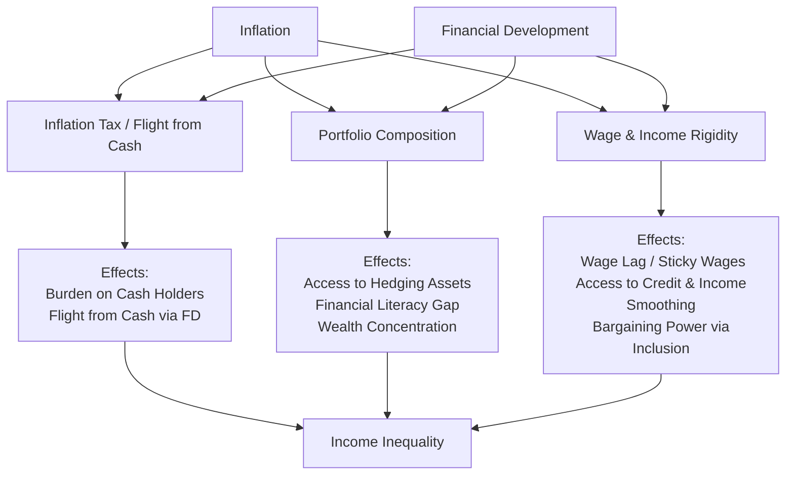

```mermaid
flowchart TB
    FD["Financial Development"]
    INF["Inflation"]
    INEQ["Income Inequality"]

    %% Channels
    IT["Inflation Tax / Flight from Cash"]
    PC["Portfolio Composition"]
    WR["Wage & Income Rigidity"]

    %% IT Effects
    IT_sub["Effects:</br> Burden on Cash Holders</br> Flight from Cash via FD"]
    
    %% PC Effects
    PC_sub["Effects:</br> Access to Hedging Assets</br> Financial Literacy Gap</br> Wealth Concentration"]

    %% WR Effects
    WR_sub["Effects:</br> Wage Lag / Sticky Wages</br> Access to Credit & Income Smoothing</br> Bargaining Power via Inclusion"]

    %% Flow connections
    INF --> IT --> IT_sub --> INEQ
    FD --> IT
    INF --> PC --> PC_sub --> INEQ
    FD --> PC
    INF --> WR --> WR_sub --> INEQ
    FD --> WR

```
