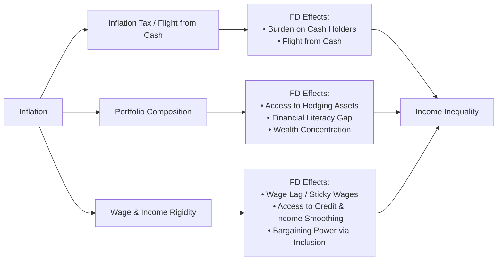

```mermaid
flowchart LR
    F["Inflation"]

    %% Channels
    A["Inflation Tax / Flight from Cash"]
    B["Portfolio Composition"]
    C["Wage & Income Rigidity"]

    %% Financial Development Effects (multiline, one item per line)
    A_sub["FD Effects:</br>• Burden on Cash Holders</br>• Flight from Cash"]
    B_sub["FD Effects:</br>• Access to Hedging Assets</br>• Financial Literacy Gap</br>• Wealth Concentration"]
    C_sub["FD Effects:</br>• Wage Lag / Sticky Wages</br>• Access to Credit & Income Smoothing</br>• Bargaining Power via Inclusion"]

    %% Flow connections
    F --> A --> A_sub --> G["Income Inequality"]
    F --> B --> B_sub --> G
    F --> C --> C_sub --> G

```
