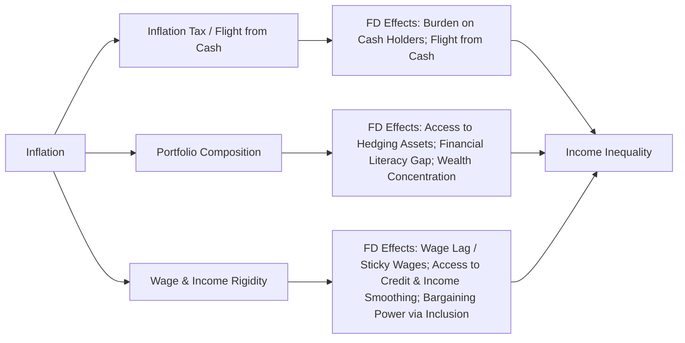

```mermaid
flowchart LR
    F["Inflation"]

    %% Channels
    A["Inflation Tax / Flight from Cash"]
    B["Portfolio Composition"]
    C["Wage & Income Rigidity"]

    %% Financial Development Effects (all in a single line per channel)
    A_sub["FD Effects: Burden on Cash Holders; Flight from Cash"]
    B_sub["FD Effects: Access to Hedging Assets; Financial Literacy Gap; Wealth Concentration"]
    C_sub["FD Effects: Wage Lag / Sticky Wages; Access to Credit & Income Smoothing; Bargaining Power via Inclusion"]

    %% Flow connections
    F --> A --> A_sub --> G["Income Inequality"]
    F --> B --> B_sub --> G
    F --> C --> C_sub --> G


```
