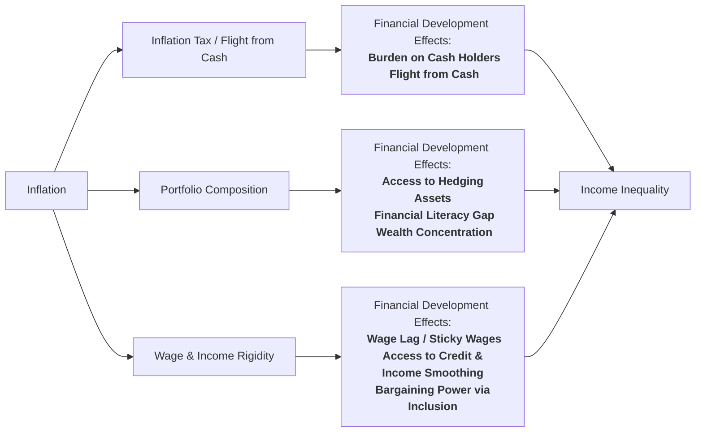

```mermaid
flowchart LR
    F["Inflation"]

    %% Channels
    A["Inflation Tax / Flight from Cash"]
    B["Portfolio Composition"]
    C["Wage & Income Rigidity"]

    %% Financial Development Effects (multiline, single line per item)
    A_sub["Financial Development Effects:<b></br> Burden on Cash Holders</br> Flight from Cash"]
    B_sub["Financial Development Effects:<b></br> Access to Hedging Assets</br> Financial Literacy Gap</br> Wealth Concentration"]
    C_sub["Financial Development Effects:<b></br> Wage Lag / Sticky Wages</br> Access to Credit & Income Smoothing</br> Bargaining Power via Inclusion"]

    %% Flow connections
    F --> A --> A_sub --> G["Income Inequality"]
    F --> B --> B_sub --> G
    F --> C --> C_sub --> G

```
